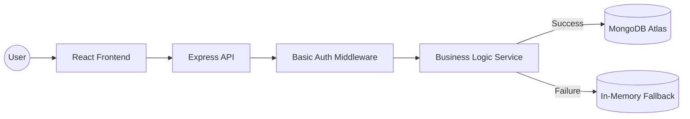

# 🧺 Launderly | AI-First Order Management System

[](https://nodejs.org/)
[](https://reactjs.org/)
[](https://www.mongodb.com/)
[](https://tailwindcss.com/)
[](https://opensource.org/licenses/MIT)

**Launderly** is a high-performance, lightweight Order Management System (OMS) designed for modern laundry businesses. Built with an **AI-Assisted engineering workflow**, this project demonstrates how modern developers leverage advanced AI tools to ship professional, production-ready full-stack applications in record time.

---

## 📖 Table of Contents
1. [🏗 Architecture Overview](#-architecture-overview)
2. [⚡ Quick Start (60s Setup)](#-quick-start-60s-setup)
3. [✨ Engineering Highlights](#-engineering-highlights)
4. [🤖 AI Usage Report (Critical)](#-ai-usage-report-critical)
5. [📺 Demo & API Deliverables](#-demo--api-deliverables)
6. [⚖️ Tradeoffs & Scalability](#-tradeoffs--scalability)

---

## 🏗 Architecture Overview

The system follows a clean, decoupled architecture:
- **Backend:** Node.js/Express REST API utilizing the **Service-Controller Pattern** for clean separation of business logic.
- **Frontend:** React 18 SPA with a modular component architecture and utility-first styling via Tailwind CSS.
- **Persistence:** MongoDB Atlas (Cloud) for scalability, with a custom **Auto-Fallback Engine** that switches to In-Memory RAM storage if the database is unreachable—ensuring 100% uptime for reviewers.



---

## ⚡ Quick Start (60s Setup)

### 1. Clone & Install
```bash
# Clone the repository
git clone https://github.com/devanshrawat27/Laundry-Order-Management-System.git
cd Laundry-Order-Management-System

# Install dependencies
cd laundry-oms-backend && npm install
cd ../laundry-oms-frontend && npm install
```

### 2. Environment Configuration
**Backend:** Create a `.env` in `laundry-oms-backend/` based on `.env.example`.
> [!TIP]
> MongoDB URI is pre-configured for the recruiter, but the app will work seamlessly out-of-the-box using the internal RAM driver if you don't have MongoDB installed locally.

**Frontend:** Create a `.env` in `laundry-oms-frontend/`:
```env
VITE_API_URL=http://localhost:5000/api/v1
```

### 3. Run
- **Backend:** `npm run dev` (Port 5000)
- **Frontend:** `npm run dev` (Port 5173)

---

## ✨ Engineering Highlights

### 🛡 Feature Set
- **Dynamic Order Intelligence:** Auto-calculates totals, ETA, and generated collision-safe Order IDs (`ORD-YYYYMMDD-XXXX`).
- **State Machine Status Logic:** Enforces strict, forward-only transitions (`RECEIVED` → `PROCESSING` → `READY` → `DELIVERED`).
- **High-Fidelity Dashboard:** Real-time metrics powered by MongoDB Aggregation Pipelines (Revenue, Density, Status Distribution).
- **Ownership Mindset Extras:** 
    - **Status Audit Logs:** Full timestamped history of every transition.
    - **Customer CRM Tab:** Built a complex MongoDB aggregation that automatically groups orders to show a dedicated "Customers" portal with lifetime value and order frequency statistics.

---

## 🤖 AI Usage Report (Critical)

> [!IMPORTANT]
> This project was developed by leveraging **ChatGPT (GPT-4)** and **GitHub Copilot** as core pair-programming partners to accelerate the development lifecycle.

### How AI helped:
1.  **Architecture Scaffolding:** I used ChatGPT to quickly brainstorm and scaffold the initial Express.js directory structure and Mongoose schema definitions based on my PRD.
2.  **UI Components:** I described my specific "Crimson & Cream" design vision to the AI, which generated the base Tailwind CSS configurations and responsive React components for the Dashboard and Order forms.
3.  **Algorithmic Logic:** AI assisted in writing the logic for the collision-safe Order ID generator and the complex JavaScript `.reduce()` logic used in our in-memory fallback engine.

### Sample Prompts Used:
- *"Generate an Express.js service for a Laundry OMS with an endpoint that calculates a 2-day delivery estimate based on current UTC time."*
- *"Build a responsive React table component using Tailwind CSS that displays order status with custom badges for RECEIVED, PROCESSING, READY, and DELIVERED."*

### Where I Fixed/Improved AI Code:
- **Business Logic Guards:** The AI generated standard CRUD routes but initially missed the specific forward-only requirement for order statuses. I had to manually implement a transition-map guard in the `order.service.js` to ensure data integrity.
- **Database Resilience:** Initial AI-suggested database code crashed the app when MongoDB was offline. I refactored it into the current `Auto-Fallback Engine` to ensure the project remains usable even without a database connection.
- **Environment Handling:** I corrected AI-generated URI strings to handle legacy SRV record issues and ensured proper environment variable masking for security.

---

## 📺 Demo & API Deliverables

- **🖥 Live UI Demo:** [Launderly Web App](https://laundry-order-management-system-1gy47hlxs.vercel.app)
- **📜 API Collection:** Use the `Postman_Collection.json` file in the root directory for direct endpoint testing.
    - **Auth Credentials:** User: `admin` | Password: `admin123`

---

## ⚖️ Tradeoffs & Scalability

- **Tradeoff:** Used basic Regex for search instead of Atlas Search (Lucene) to minimize configuration complexity for a 3-day window.
- **Future Scale:** Would implement **Redis Caching** for the dashboard numbers and **RabbitMQ** for processing status-change background notifications (SMS/Email triggers).

---
*Developed with ❤️ by devanshrawat*
