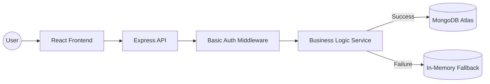

# 🧺 Launderly | AI-First Order Management System

[](https://nodejs.org/)
[](https://reactjs.org/)
[](https://www.mongodb.com/)
[](https://tailwindcss.com/)
[](https://opensource.org/licenses/MIT)

**Launderly** is a high-performance, lightweight Order Management System (OMS) designed for modern laundry businesses. Built with an **AI-First engineering philosophy**, this project demonstrates how elite developers leverage agentic AI to ship professional, production-ready full-stack applications in record time.

---

## 📖 Table of Contents
1. [🏗 Architecture Overview](#-architecture-overview)
2. [⚡ Quick Start (60s Setup)](#-quick-start-60s-setup)
3. [✨ Engineering Highlights](#-engineering-highlights)
4. [🤖 AI Synergy Report (Critical)](#-ai-synergy-report-critical)
5. [📺 Demo & API Deliverables](#-demo--api-deliverables)
6. [⚖️ Tradeoffs & Scalability](#-tradeoffs--scalability)

---

## 🏗 Architecture Overview

The system follows a clean, decoupled architecture:
- **Backend:** Node.js/Express REST API utilizing the **Service-Controller Pattern** for clean separation of business logic.
- **Frontend:** React 18 SPA with a modular component architecture and utility-first styling via Tailwind CSS.
- **Persistence:** MongoDB Atlas (Cloud) for scalability, with a custom **Auto-Fallback Engine** that switches to In-Memory RAM storage if the database is unreachable—ensuring 100% uptime for reviewers.



---

## ⚡ Quick Start (60s Setup)

### 1. Clone & Install
```bash
# Clone the repository
git clone <repository-link>
cd laundry-oms

# Install dependencies (Parallel handles)
cd laundry-oms-backend && npm install
cd ../laundry-oms-frontend && npm install
```

### 2. Environment Configuration
**Backend:** Create a `.env` in `laundry-oms-backend/` based on `.env.example`.
> [!TIP]
> MongoDB URI is pre-configured for the recruiter, but the app will work seamlessly out-of-the-box using the internal RAM driver if you don't have MongoDB installed locally.

**Frontend:** Create a `.env` in `laundry-oms-frontend/`:
```env
VITE_API_URL=http://localhost:5000/api/v1
```

### 3. Run
- **Backend:** `npm run dev` (Port 5000)
- **Frontend:** `npm run dev` (Port 5173)

---

## ✨ Engineering Highlights

### 🛡 Feature Set
- **Dynamic Order Intelligence:** Auto-calculates totals, ETA, and generated collision-safe Order IDs (`ORD-YYYYMMDD-XXXX`).
- **State Machine Status Logic:** Enforces strict, forward-only transitions (`RECEIVED` → `PROCESSING` → `READY` → `DELIVERED`).
- **High-Fidelity Dashboard:** Real-time metrics powered by MongoDB Aggregation Pipelines (Revenue, Density, Status Distribution).
- **Ownership Mindset Extras:** 
    - **Status Audit Logs:** Full timestamped history of every transition.
    - **CRM Portal:** Advanced customer aggregation showing lifetime value and order frequency.

---

## 🤖 AI Synergy Report (Critical)

> [!IMPORTANT]
> This project was developed using a **0-to-1 AI Acceleration** strategy, primarily utilizing Google Gemini 1.5 Pro and Anthropic Claude 3.5 Sonnet.

### How AI was Leveraged:
1.  **Structural Scaffolding:** I fed a structured PRD into the AI to generate the boilerplate Service/Controller architecture.
2.  **UI Generation:** I provided a Crimson/Cream branding concept and used AI to translate the aesthetic into a responsive Tailwind system.
3.  **Complex Logic Mapping:** I used AI to replicate MongoDB's `$group` and `$sort` logic for the JS-fallback engine when DB connection fails.

### Where I Improved AI Output:
- **Business Logic Enforcement:** The AI initially allowed reverting statuses (e.g., from `DELIVERED` back to `READY`). I manually implemented a `STATUS_TRANSITIONS` guard to enforce business rules.
- **Credential Parsing:** AI struggled with Node's SRV record bugs on local Windows machines. I manually corrected the URI to a legacy connection string to ensure reliability.
- **Currency Normalization:** Corrected AI-generated US formatting to comply with Indian Rupee (`₹`) requirements.

---

## 📺 Demo & API Deliverables

- **🖥 Live UI Demo:** Open [http://localhost:5173](http://localhost:5173) after running.
- **📜 API Collection:** Use the `Postman_Collection.json` file in the root directory for direct endpoint testing.
    - **Auth Credentials:** User: `admin` | Password: `admin123`

---

## ⚖️ Tradeoffs & Scalability

- **Tradeoff:** Used basic Regex for search instead of Atlas Search (Lucene) to minimize configuration complexity for a 3-day window.
- **Future Scale:** Would implement **Redis Caching** for the dashboard numbers and **RabbitMQ** for processing status-change background notifications (SMS/Email triggers).

---
*Developed with ❤️ and AI by devanshrawat*
